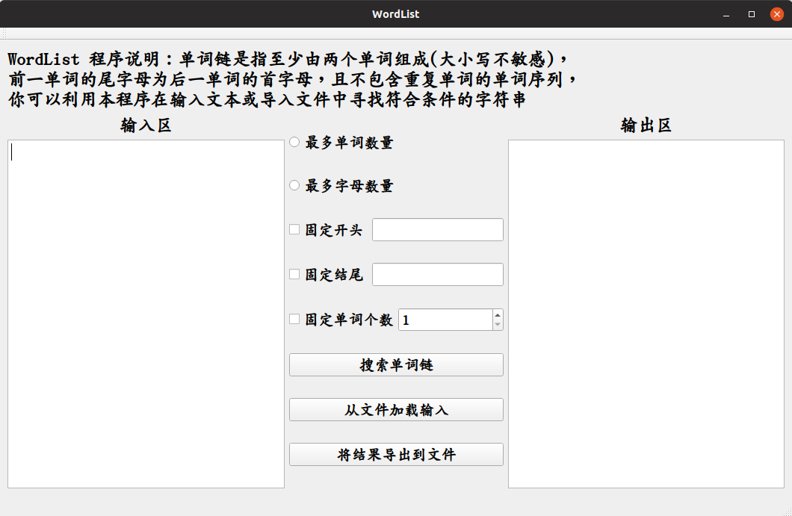

# 使用说明


## 命令行使用说明

使用平台：linux(ubuntu)

### 编译

- 操作系统：`Ubuntu 18.10`
- 编译器版本：`g++ (Ubuntu 8.2.0-7ubuntu1) 8.2.0`
- C++版本：C++11
- 自动编译：（环境配置：`GNU Make 4.2.1`）

```shell
$ cd ./src
$ make
```

- 直接编译：

```shell
$ g++ main.cpp -o ./Wordlist -std=c++11 -static
```


### 使用方法

Usage: Wordlist [arguments] <filename>

**Mandatory arguments:**

`-c`: Output one word list with the most characters.

`-w`: Output one word list with the most words.

**Optional arguments:   **

`-h <char>`: Determine the head character of the word list. 

`-t <char>`: Determine the tail character of the word list.

  (Note: -h and -t can be used at the same time)

`-n <num>`: Output all word lists containing <num> words.

(Note: -n must be used with -w)


## GUI使用说明

### 开发环境

| 操作系统       | Ubuntu 18.10                                                 |
| -------------- | ------------------------------------------------------------ |
| **编译环境**   | **g++ (Ubuntu 8.2.0-7ubuntu1) 8.2.0**                        |
| **图形库**     | **Qt 5.12.0 GCC64bit**                                       |
| **设计工具**   | **Qt Creator 4.8.0**                                         |
| **依赖库说明** | 将命令行程序作为依赖库添加在图形化程序目录下，重命名为`WordlistCUI` |


### 编译方法

1. 使用Qt Creator 构建项目
2. 若不具备Qt Creator，则建议如下编译：

```shell
$ qmake WordList.pro -spec linux-g++ CONFIG+=qtquickcompiler
$ cd ../build-WordList-Desktop_Qt_5_12_0_GCC_64bit-Release/
$ make
```


### 界面概览

