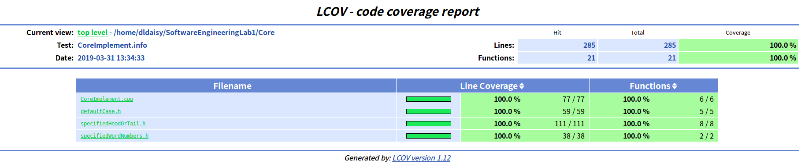

# Lab1-b实验文档


> 小组成员
>
> PB16111485　张劲暾	 PB16080210　戴路	PB16110428　王浩宇


## 实验需求

1. 将计算单词链的功能独立出来，成为一个独立的模块`Core`，便于被
   * 命令行测试程序使用
   * 在单元测试框架下使用
   * 与数据可视化部分结合使用

2.  设计`Core`模块的API

3. 设计针对`Core`模块的单元测试


## 使用说明

测试环境：Ubuntu 16.04

库依赖：gcov, lcov, firefox浏览器

1. 进入文件夹

   假设当前位于本仓库中

   ```bash
   cd ./Core/unit_test
   ```

2. 编译

   ```bash
   make
   ```

   一键编译后，在命令行会输出测试是否通过的结果，firefox浏览器中会输出单元测试覆盖率情况


## Core模块接口


### 功能０：数据预处理

* **函数功能**

  从原始输入中剔除不符合要求的字符，提取单词，并将大写转化为小写

* **接口设计**

  Core模块中该功能的API为：

  ```c++
  std::vector<std::string> preprocessingData(std::string crudeData)
  ```

  其中，返回值为合法的单词列表，可传递给各个功能函数．

* **参数含义**

  * `crudeData`

    类型：`std::string`

    含义：原始的输入．比如输入txt文件里的全部内容．

### 功能１：计算最多单词数量的最长单词链

* **函数功能**

  给定单词列表，输出包含单词数最多的单词链

  若指定开头字母`head`，则输出以字母`head`开头的最长单词链

  若指定结尾字母`tail`，则输出以字母`tail`结尾的最长单词链


* **接口设计**

  Core模块中该功能的API为：

  ```c++
  int gen_chain_word(std::vector<std::string> &words, std::vector<std::string> &result, char head = 0, char tail = 0);
  ```

  其中，返回值为最长单词链中的单词数目．

* **参数含义**

  * `words`

    类型：`std::vector<std::string>&`

    含义：输入的单词列表

  * `result`

    类型：`std::vector<std::string>`

    含义：输出的单词链, 通过引用返回．

  * `head`

    类型：`char`

    含义：指定单词链的开头字母．默认值为0，即默认不指定开头字母

  * `tail`

    类型：`char`

    含义：指定单词链的结尾字母．默认值为０，即默认不指定结尾字母


### 功能２：计算最多字母数量的单词链

* **函数功能**

  给定单词列表，输出包含字母数最多的单词链

  若指定开头字母`head`，则输出以字母`head`开头的字母数最多单词链

  若指定结尾字母`tail`，则输出以字母`tail`结尾的字母数最多单词链

* **接口设计**

  Core模块中该功能的API为：

  ```c++
  int gen_chain_char(std::vector<std::string> &words, std::vector<std::string> &result, char head = 0, char tail = 0)
  ```

  其中，返回值为最多字母数量单词链中的单词数目．

* **参数含义**

  - `words`

    类型：`std::vector<std::string>&`

    含义：输入的单词列表

  - `result`

    类型：`std::vector<std::string>`

    含义：输出的单词链，通过引用返回．

  - `head`

    类型：`char`

    含义：指定单词链的开头字母．默认值为0，即默认不指定开头字母

  - `tail`

    类型：`char`

    含义：指定单词链的结尾字母．默认值为０，即默认不指定结尾字母


### 功能３：计算指定单词数目的所有单词链

* **函数功能**

  给定单词列表并指定单词链中单词数目，输出所有符合要求的单词链

  若指定开头字母`head`，则输出所有以字母`head`开头的单词链

  若指定结尾字母`tail`，则输出所有以字母`tail`结尾的单词链

* **接口设计**

  Core模块中该功能的API为：

  ```c++
  int all_chain_word(std::vector<std::string> &words, std::set<std::vector<std::string>> &result, int n, int & error_flag,　char head = 0, char tail = 0);
  ```

  其中，返回值为符合要求的单词链的数目．

* **参数含义**

  - `words`

    类型：`std::vector<std::string>&`

    含义：输入的单词列表

  - `n`

    类型：`int`

    含义：单词链中指定的单词数目

  - `error_flag`

    类型：`int`

    含义：用于传递错误信息．比如，n=1时（不构成单词链）, error_flag被设置为１, 从而被调用该API的主体感知到．

  - `result`

    类型：`std::set<std::vector<std::string>>`

    含义：输出的所有单词链的集合，通过引用返回．

  - `head`

    类型：`char`

    含义：指定单词链的开头字母．默认值为0，即默认不指定开头字母

  - `tail`

    类型：`char`

    含义：指定单词链的结尾字母．默认值为０，即默认不指定结尾字母


`Core`模块的总接口实现如下：

```c++
class Core{
    // 对外发布的接口
    public:
    	//功能１
        virtual int gen_chain_word(std::vector<std::string> &words, std::vector<std::string> &result, char head = 0, char tail = 0);
    	//功能２
        virtual int gen_chain_char(std::vector<std::string> &words, std::vector<std::string> &result, char head = 0, char tail = 0);
    	//功能３
        virtual int all_chain_word(std::vector<std::string> &words, std::set<std::vector<std::string>> &result, int n, int & error_flag,char head = 0, char tail = 0);
        //功能０
        virtual std::vector<std::string> preprocessingData(std::string crudeData);
};
```


## 测试结果

本次设计的单元测试覆盖率为100%, 覆盖率截图如下：




4个文件分别为：

* `CoreImplement.cpp`：实现接口的封装

* `defaultCase.h`：实现功能1,2

* `specifiedHeadOrTail.h`: 实现功能0,3

* `specifiedWordNumbers.h`: 实现功能４


单元测试通过结果为：


其中，在**All tests passed**上方是测试报错情况时输出的报错信息


##　测试设计


### 测试框架

* **采用的测试框架为`catch`**

  `catch`是一种Ｃ++单元测试框架，其相关测试函数均被封装在`catch.hpp`文件中.


* **采用`gcov`+`lcov`测试代码覆盖率**
  * `gcov`是一个测试代码覆盖率的工具。与GCC一起使用来分析程序，以帮助创建更高效、更快的运行代码，并发现程序的未测试部分
  * `lcov`是`gcov`的图形化前端．其通过`gcov`产生的数据，在html页面上显示图形化的覆盖率测试结果，并在源代码中标注是否覆盖．


为了全面测试代码的功能，我们从以下几个方面设计了单元测试

### 基础功能测试

* 测试文件: 实验一中助教所给的测试数据，具体包括两个测试样例：

  样例一：

  ```
  Algebra
  Apple
  Zoo
  Elephant
  Under
  Fox
  Dog
  Moon
  Leaf
  Trick
  Pseudopseudohypoparathyroidism
  ```

  样例二：

  ```
  Word 
  Digital 
  List
  ```


  样例一用于测试功能1,2，即单词数/字母数最多的单词链

  样例二用于测试功能3, 即给定单词数的所有单词链


  样例一部分测试代码截图如下：

  


　　样例二部分测试代码截图如下：

​	


### 报错情况测试

对于不符合规定的情况代码应当能报错,例如由于单词链长度至少为２，若要求寻找长度为１的单词链则应当报错`error: as defined, word list must have a length at least 2`


测试代码举例：


### 边界情况测试

对于特殊的数据应当能有所应对．例如若测试数据过大，则采用限制时间并输出当前最长的单词链的方法来输出当前最优结果．

测试代码举例：

`./Core/unit_test/test/test_4.txt`

```
ab ac ad ae af ag ah
ba bc bd be bf bg bh
ca cb cd ce cf cg ch
da db dc de df dg dh
ea eb ec ed ef eg eh
fa fb fc fd fe fg fh
ga gb gc gd ge gf gh
ha hb hc hd he hf hg
```

该文件中含有64个节点的有向完全图, 搜索树分支因子为８，因此搜索空间极大．

施加运行时间限制后，仅返回最优结果并输出信息：

`Time limits. The word list output may not be the longest one.`

测试代码如下：


